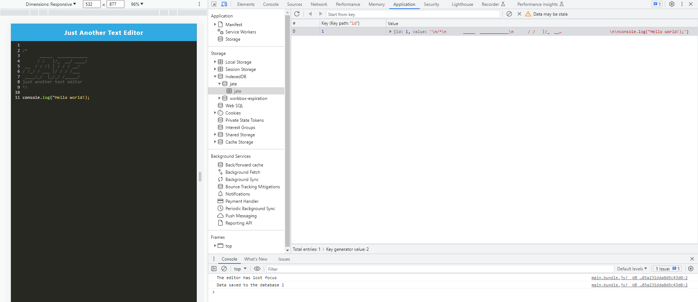

# Text-Editor

## Description
This text editor web application is a single-page PWA application that is meant for note-taking with JavaScript syntax highlighting. It uses webpack plugins to generate the HTML file, service worker, and a manifest file and can operate in the user's browser offline. When the user opens the application, IndexedDB immediately creates a database storage that saves any updated text every time the user clicks off of the DOM window. The user can also install this application to their system by clicking the 'Install!' button; the application will appear as an icon on their system navigation bar. Exiting the browser or window will not remove the user's changes as their input is saved to the IndexedDB database and displayed the next time they open the application. Assets are precaches upon loading with subsequent pages and static assets.

## Credit
Thank you to my classmates; May Pham and Joey Lee; for partnering with me to work on this challenge. Here are their GitHub profiles--

May Pham: https://github.com/mayphamx

Joey Lee: https://github.com/Rockojoe2

## License
This repository is licensed by MIT. See https://mit-license.org/ to learn more.

## Usage
Visit the deployed Heroku site here: https://micavilla-text-editor-80b2c8eb1dd0.herokuapp.com/

Clone my GitHub repository from here: https://github.com/micavilla/text-editor
